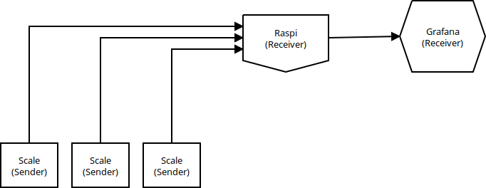

# Drinks Storage State

This repo contains the design files (not yet) and firmware for the hardware, which measures the state of our beverage storage site.

## Concept
Our beverage storage site consists of multiple stacks of crates, where each stack can only contain one type of bottles which are either all full or all empty.

Each of the stacks is standing on a special scale, which monitors how many crates are on the stack.
Those special scales contain ESP8266 and send their state to a central server. The data is processed at server site and forwarded to a graphana server for visualisation.

## Hardware
The Hardware is based on a board with 4 load cells attached to it according to the schematic of this [Load Sensor Combinator](https://www.sparkfun.com/products/13878):

| JP1_UL  |     | Upper Left |
| ------- | --- | ---------- |
| C       | RED | E-         |
| +       | WHT | JP2_UR_WHT |
| -       | BLK | JP3_LL_BLK |

| JP2_UR  |     | Upper Right |
| ------- | --- | ----------- |
| C       | RED | A-          |
| -       | BLK | JP4_LR_BLK  |

| JP3_LL  |     | Lower Left |
| ------- | --- | ---------- |
| C       | RED | A+         |
| +       | WHT | JP4_LR_WHT |

| JP4_LR  |     | Lower Right |
| ------- | --- | ----------- |
| C       | RED | E+          |

The signals of the load cells are amplified and digitalized by an HX711 load cell amplifier which is connected to an ESP8266 Board.

Currently the HX711 is hooked up to pins 12 & 14 (clock & data) of the ESP.

## Software
The software is written with the Arduino framework and build using [platformio](http://platformio.org/). To build the firmware and upload it to the ESP simply install platfomio and run `platformio run -t upload`.
